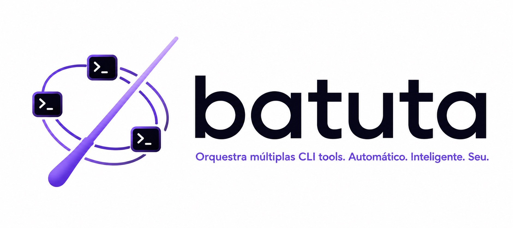

<p align="center">
  
</p>

> 🇧🇷 [Versão em português](README.pt-BR.md)

> **Quem rege não toca.** — The conductor does not play.

**Batuta** turns the AI coding agent you already talk to into a **conductor**: it
classifies the task, routes it to the cheapest executor that can handle it,
writes the brief, delegates, verifies the diff and commits. The code is written
by **executors** — `codex`, `opencode` (Kimi, DeepSeek, GLM…), `cursor-agent`,
`agy` (Antigravity), a background `claude` — or by the conductor itself, only
for critical work.

You spend the expensive model where it matters (deciding, reviewing, guaranteeing
quality) and cents where any model does the job (writing the code of a
well-specified task).

This repository is the **host package**: one install for every CLI. The skills
and doctrine live in [batuta-ai/skills](https://github.com/batuta-ai/skills)
(vendored here under `skills/`), the `batuta` binary in
[batuta-ai/core](https://github.com/batuta-ai/core), and the CompozyOS
extension in [batuta-ai/compozy](https://github.com/batuta-ai/compozy).

## Install

One command, every detected host:

```bash
npx -y github:batuta-ai/batuta
```

`--list` shows the host matrix, `--dry-run` prints what would run, `--only <host>`
targets one. Per host, the same thing by hand:

| Host | Install | Entry points |
|---|---|---|
| Claude Code | `claude plugin marketplace add batuta-ai/batuta` · `claude plugin install batuta@batuta` | the `batuta` skill on any code task; `/batuta:init`, `/batuta:plan`, `/batuta:loop`, `/batuta:review`, `/batuta:status`, `/batuta:route`, `/batuta:pause`, `/batuta:resume` |
| Codex CLI | `codex plugin marketplace add batuta-ai/batuta` · `codex plugin add batuta@batuta` | `$batuta`, `$batuta-init`, `$batuta-plan`, … |
| Cursor | `npx -y github:batuta-ai/batuta -- --only cursor` (vendored skills → `~/.agents/skills`) | the skills, by name |
| opencode | `npx -y github:batuta-ai/batuta -- --only opencode` (vendored skills → `~/.agents/skills` + `hosts/opencode/commands/`) | `/batuta`, `/batuta-init`, … |
| Antigravity (`agy`) | `npx -y github:batuta-ai/batuta -- --only agy` (vendored skills → `~/.agents/skills`); any other agent: `npx skills add batuta-ai/skills -g` | the skills, by name |
| CompozyOS | `compozy extension install github:batuta-ai/compozy --allow-unverified --yes` | the `batuta` agent |

The `batuta` binary (executor inventory, verification gates, unattended loop) is
installed with `go install github.com/batuta-ai/core/cmd/batuta@latest` when Go
is present; the skills work without it.

Then, in a project: `/batuta:init` once, and just ask for code tasks.

## How it works

```
        you: "fix the login 500 when the email has a +"
          │
          ▼
   ┌─────────────┐    classifies: medium backend
   │  CONDUCTOR  │──► routes: → codex (ChatGPT subscription, already paid)
   │ (your agent)│    writes the brief: context + files + acceptance criteria
   └──────┬──────┘
          │ delegates
          ▼
   ┌─────────────┐
   │    CODEX    │──► writes the code
   └──────┬──────┘
          │ diff
          ▼
   ┌─────────────┐    scope check, diff review
   │  CONDUCTOR  │──► runs the tests itself
   │             │    re-runs each criterion's proof
   └──────┬──────┘
          │ ✅ passed
          ▼
    atomic commit + one line in WORK.md
```

Verification fails → the executor gets specific feedback and **one retry**.
Fails again → the task **escalates** one row up the routing table. A request
that is a list — six components, say — is **decomposed** first: six cycles, six
commits.

## The four guarantees

| Guarantee | How |
|---|---|
| **Atomic commits** | one verified task = one commit; undo is trivial |
| **Resumable state** | a single `WORK.md` in prose; close the terminal, come back tomorrow |
| **Plan when needed** | clear task goes straight in; ambiguous task gets two or three questions; long work gets `/batuta:plan` |
| **Verification always** | scope, diff review, tests run by the conductor, criteria with re-run proof — the executor's report is never evidence |

## Routing

| Lane | Examples | Default executor | Cost |
|---|---|---|---|
| `low` | rename, config, copy, simple test | opencode + a budget model | cents (API) |
| `medium` | isolated feature, bugfix with clear repro | codex, default model | ChatGPT subscription |
| `high` | multi-file work a precise brief can fully specify | codex, strongest model, high reasoning | ChatGPT subscription |
| `critical` | architecture, security, anything needing the conversation | the conducting host itself | host subscription |

Rows may be split by domain (`frontend` → `cursor-agent`, say). Onboarding
discovers what is installed and proposes the table; you confirm every row.
Adding an executor is one markdown file: `skills/batuta/adapters/_template.md`.

`/batuta:status` reads `WORK.md` back as facts: tasks per lane, delegation
rate, escalation rate. No invented accounting.

## Layout

```
.claude-plugin/  .codex-plugin/  .cursor-plugin/  .agents/plugins/   host manifests
commands/                thin /batuta:* routers for Claude Code
hosts/opencode/commands/ the same routers for opencode
hooks/ scripts/          SessionStart hook (one line of context) and the skills sync
skills/                  vendored from batuta-ai/skills at the tag in skills-lock.json
bin/install.js           the multi-host installer
docs/                    design specs; docs/specs-history holds the v1 PRD and plans
```

`scripts/sync-skills.sh <tag>` updates the vendored skills; `tests/check.sh`
fails when `skills/` drifts from the lock.

## Philosophy

1. **The conductor does not play** — tokens go to directing, not typing code.
2. **Process weighs as little as the task allows** — planning is adaptive, never a prerequisite.
3. **State is prose, not schema** — nothing breaks on an unescaped pipe.
4. **Every delivery is verified** — always, no exceptions.
5. **Extensible by file, not by code** — new executor = new markdown file.

## Inspirations

[andrej-karpathy-skills](https://github.com/multica-ai/andrej-karpathy-skills)
(verifiable goals, diff traceability, orphans), the
[GSD](https://github.com/gsd-build/get-shit-done) family (which guarantees are
worth their weight), [pedronauck/skills](https://github.com/pedronauck/skills)
(self-report is not evidence, scoped writes, the rent test) and
[beer-and-code-harness](https://github.com/beerandcodeteam/beer-and-code-harness)
(mechanical gates, preflight, thin routers).

## License

[MIT](LICENSE)
